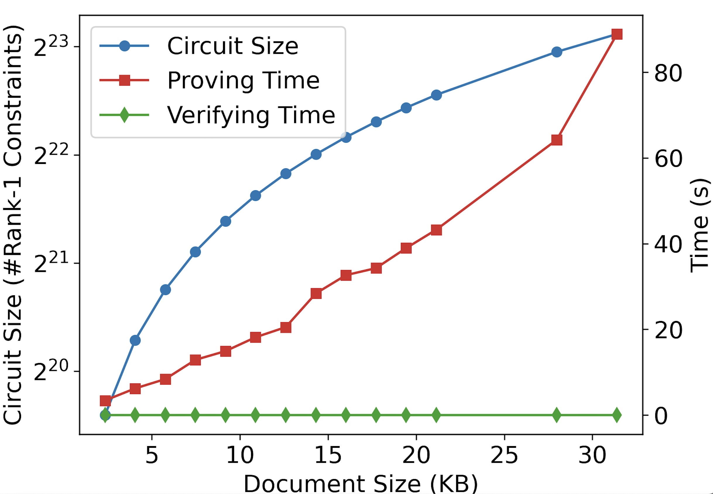
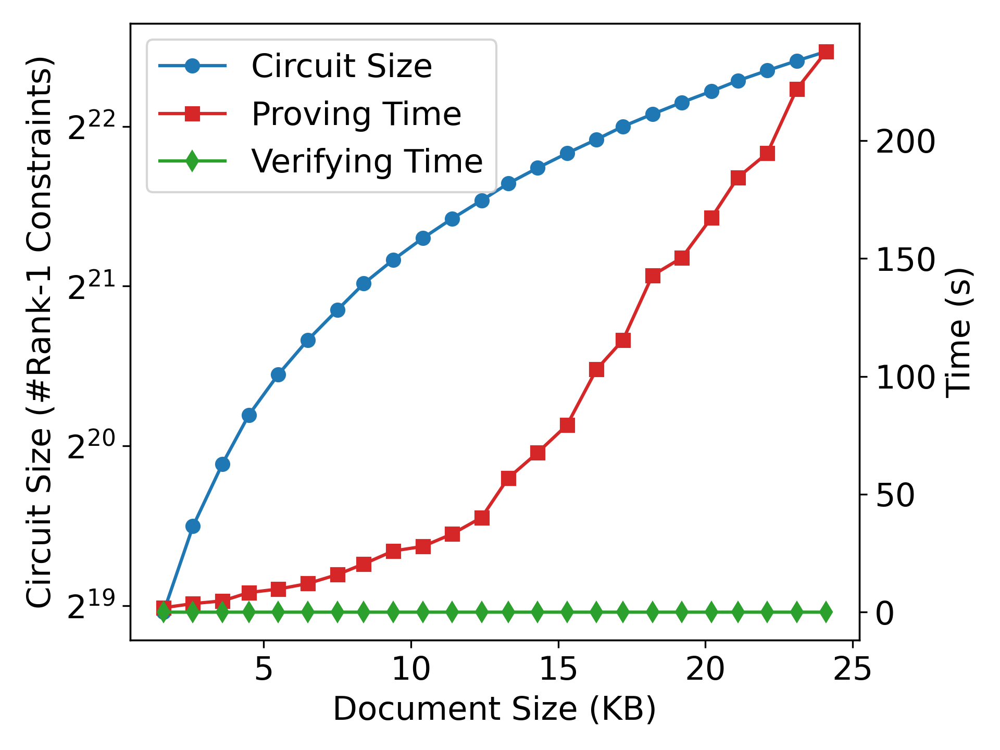

# IDEA-DAC
Integrity-Driven Editing for Accountable
Decentralized Anonymous Credentials via ZK-JSON

## Description
The repository illustrates the comprehensive construction of the IDEA-DAC zero-knowledge proof circuit, as detailed in https://eprint.iacr.org/2024/292. 
The circuits are developed utilizing the Gnark library, employing the Groth-16 protocol for the proof system.


### Circuit functionalities
The demonstration of all circuit constructions resides in the circuit folder.
* [commit.go](circuit/commit.go) presents the ZKP circuit for the generation of the MIMC commitment to a message.
* [encryption.go](circuit/encryption.go) exhibits the circuit for MIMC encryption. 
* [compare.go](circuit/compare.go) illustrates various examples of editing bounds circuit implementations, including Append only, Number in range, One of set, Time in range, and Certain format. 
* [encode.go](circuit/encode.go) serves for the encoding of a JSON file into field elements, with additional implementations for encoding basic data types found in JSON files.
* [types.go](circuit/types.go) repurposes data types in JSON files to utilize field elements.
* [utils.go](circuit/utils.go) supplies auxiliary circuits for operations such as bit shifting, comparison of number relations, and verification of hint results, among others.
* [hint.go](circuit/hint.go) executes intensive computations outside the circuit, such as divide&mod, merge, etc., with the results subsequently verified within the circuit by [utils.go](circuit/utils.go).
* [editCircuitPhd.go](circuit/editCircuitPhd.go) acts as the central component of the circuits, employing the circuits outlined above to verify the accuracy of JSON file encoding, commitment, and encryption. This component also evaluates the legality of editing activities performed on a PhD profile JSON file.


### Example
Within the cmd folder lies a phd_profile directory, serving as a practical example to exhibit the IDEA-DAC algorithm. 
This example provides two JSON files, representing the profiles before and after edits, denoted as the old and new profiles, respectively. 
To engage with the IDEA-DAC, execute the following command in this directory:
```
go run main.go [n]
```
Here, n signifies the maximum number of publications, correlating to the profile file's size. 
An approximate addition of 8 publications will augment the file size by 1KB.

In the [IDEA-DAC](https://eprint.iacr.org/2024/292) paper, this codebase was employed for experimental analysis.

The algorithm underwent testing on an AWS EC2 r5a.8xlarge instance, configured with 32 vCPUs and 256GB of memory, as depicted above.

Conversely, the above illustration showcases an experiment conducted on a local machine, specifically a MacBook Pro equipped with an M1 Pro chip and 32GB of memory.

